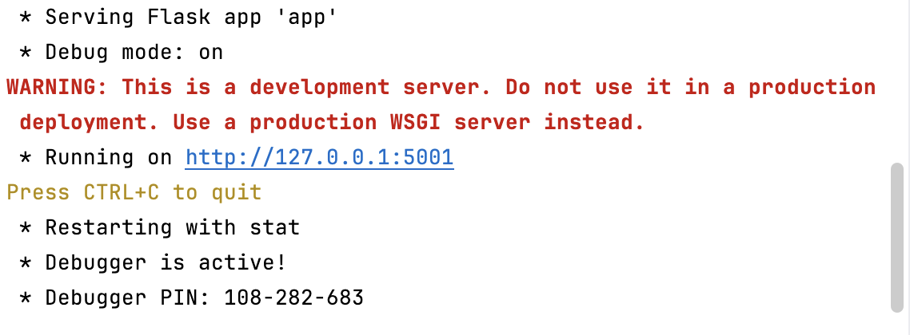

# Super Glue

SuperGlue is a web-based tool for molecular annotation and similarity search. Users can upload chemical compound datasets, visualize molecular structures, and perform similarity searches to analyze relationships between compounds.

## Features
- Upload and preview **CSV files** with compound data.
- **Similarity search** for molecular structures using different metrics.
- **Interactive visualization** of molecular structures.
- **Molecular editing and annotation** powered by **Ketcher**.
- Responsive **frontend (React)** and powerful **backend (Python/RDKit)**.

## Tech Stack  
### **Frontend (React + Vite)**
- React (JavaScript)
- Vite (Fast frontend bundler)
- Styled Components & CCS Modules

### **Backend (Python + RDKit)**
- Flask (API)
- RDKit (Molecular similarity)
- Pandas (Data processing)

## Installation
### **1. Clone the Repository**
#### (1) Find the repo url: https://github.com/SuperGlue2025/SuperGlue2025.git
#### (2) Run the following command in your terminal: `git clone https://github.com/SuperGlue2025/SuperGlue2025.git`
#### 
### **2. Set Up Backend**
#### 
### **3. Start Backend**
#### (1) Run the command in terminal: `cd backend`
#### (2) Then run the command `python app.py`  If everything is working properly, the terminal will display information similar to the following:  

### **4. Set Up Frontend**
#### (1) Make sure Node.js and npm are installed on your computer.  If not yet installed, you can download and install them from the [Node.js official website](https://nodejs.org/en).  Check Node.js and npm versions, run: `node -v` and `npm -v`.   If both commands display version numbers, the installation was successful.
#### (2) Install Project Dependencies.   In the terminal (Terminal / CMD / PowerShell), navigate to the project directory: `cd superglue-front`  Then run: `npm install` This command will install all dependencies listed in the package.json file.
#### (3) Run the Development Environment.  After installation is complete, run: `npm run dev`  If everything is working properly, the terminal will display information similar to the following: 

## Usage
1. **Upload a CSV file** with compound IDs and SMILES.
2. **Navigate the dataset** using the summary page.
3. **Click on a compound** to view its molecular structure.
4. **Use Ketcher** to edit molecular structures and add annotations.
5. **Perform a similarity search** by entering a SMILES query.

## Contributors
- Haoyu He
- Hongyan Liu
- Zoe Williams
- Junyi Ying

## Acknowledgements
- Dr. Orion Dollar - Sponsor representative, providing guidance and conveying the company's needs.
- Dr. David Beck - Capstone professor, offering insights and software engineering advice.

## License
This project is licensed under the MIT License.
