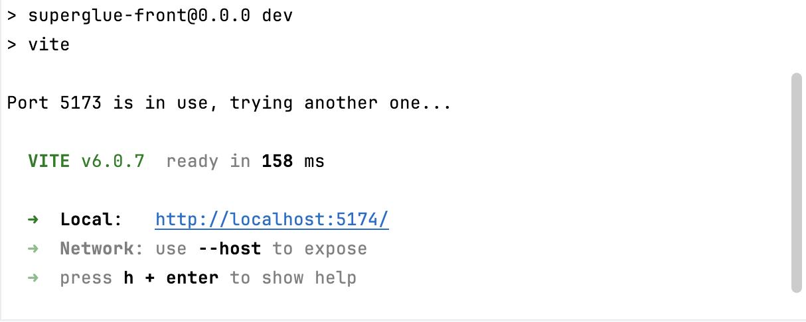

# Super Glue


SuperGlue is a web-based tool for molecular annotation and similarity search. Users can upload chemical compound datasets, visualize molecular structures, and perform similarity searches to analyze relationships between compounds.

## Features
- Upload and preview **CSV files** with compound data.
- **Similarity search** for molecular structures using different metrics.
- **Interactive visualization** of molecular structures.
- **Molecular editing and annotation** powered by **Ketcher**.
- Responsive **frontend (React)** and powerful **backend (Python/RDKit)**.

## Tech Stack  
### **Frontend (React + Vite)**
- React (JavaScript)
- Vite (Fast frontend bundler)
- Styled Components & CCS Modules

### **Backend (Python + RDKit)**
- Flask (API)
- RDKit (Molecular similarity)
- Pandas (Data processing)

## Installation
### **1. Clone the Repository**
```
git clone https://github.com/SuperGlue2025/SuperGlue2025.git
cd SuperGlue
```
### **2. Set Up Backend**
#### **(1) Navigate to the Backend Folder**
```
cd backend
```
#### **(2) Set Up a Virtual Environment (Recommended)**
```
python -m venv venv
source venv/bin/activate  # (Windows: venv\Scripts\activate)
```
#### **(3) Install Dependencies**
```
pip install -r requirements.txt
```
#### **(4) Start the Backend Server**
```
python app.py
```

### **3. Set Up Frontend**
#### (1) Ensure Node.js and npm are Installed
Check if Node.js and npm are installed:
```
node -v
npm -v
```
If both commands display version numbers, Node.js is installed.
Otherwise, download it from the [Node.js official website](https://nodejs.org/en).

#### (2) Navigate to the Frontend Folder & Install Dependencies
```
cd ../frontend
npm install
```
This command will install all required dependencies from `package.json`.

#### (3) Start the Development Server
```
npm run dev
```
If everything is working properly, the terminal will display information similar to the following:


## Usage
1. **Upload a CSV file** with compound IDs and SMILES.
2. **Navigate the dataset** using the summary page.
3. **Click on a compound** to view its molecular structure.
4. **Use Ketcher** to edit molecular structures and add annotations.
5. **Perform a similarity search** by entering a SMILES query.


## Contributors
- Haoyu He
- Hongyan Liu
- Zoe Williams
- Junyi Ying

## Acknowledgements
- Dr. Orion Dollar - Sponsor representative, providing guidance and conveying the company's needs.
- Dr. David Beck - Capstone professor, offering insights and software engineering advice.

## License
This project is licensed under the MIT License.
