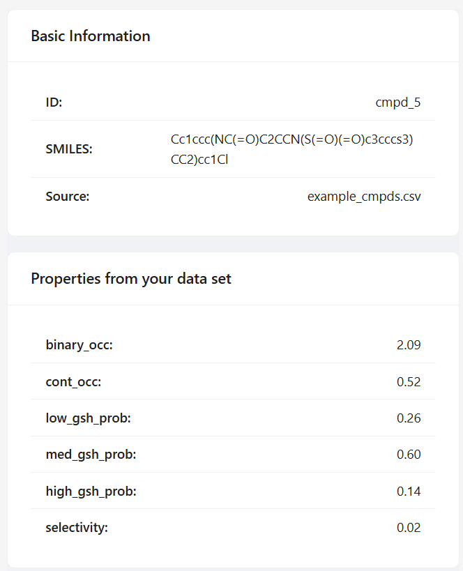
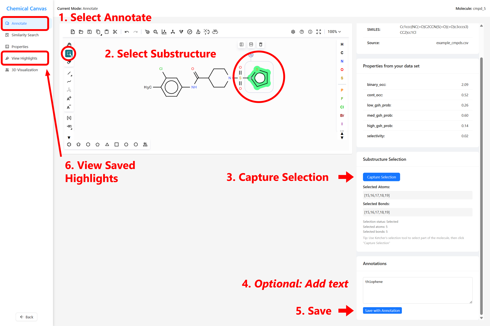
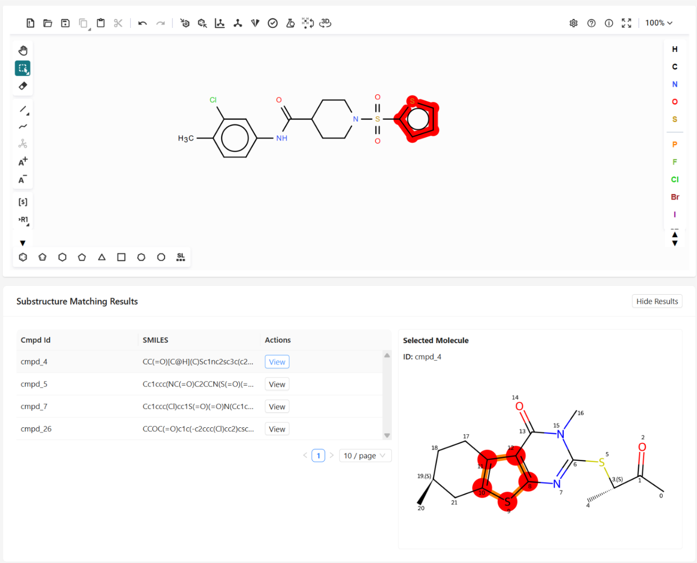
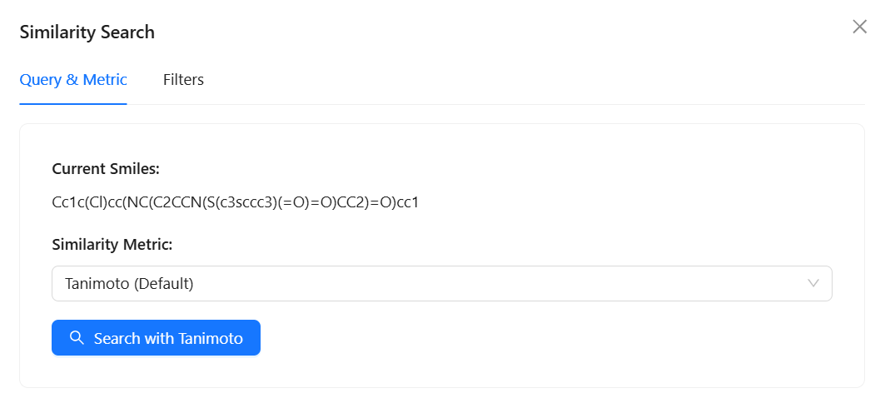
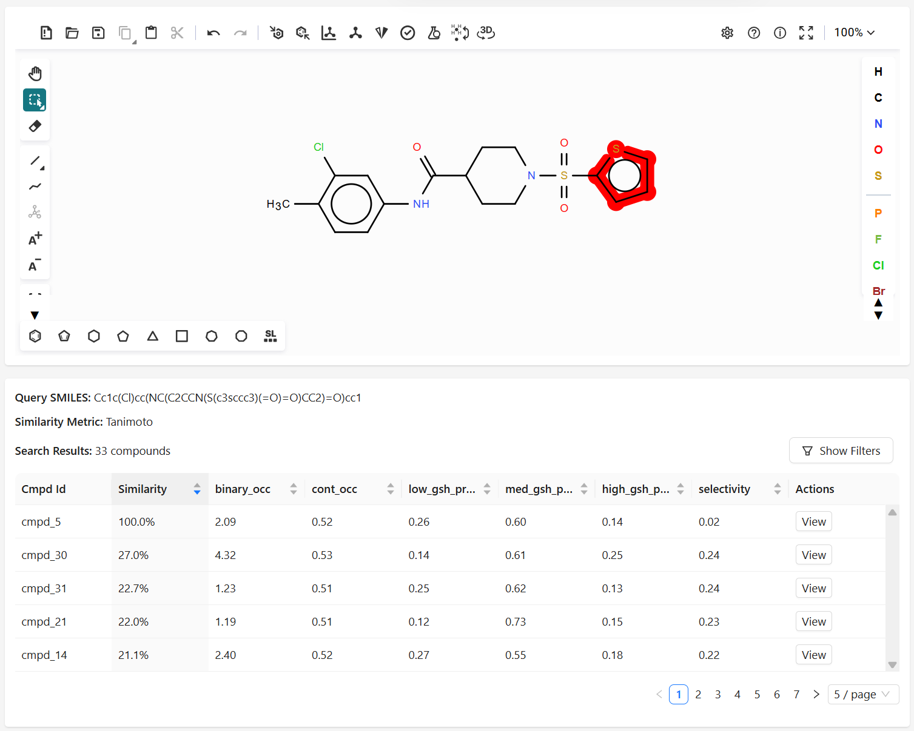
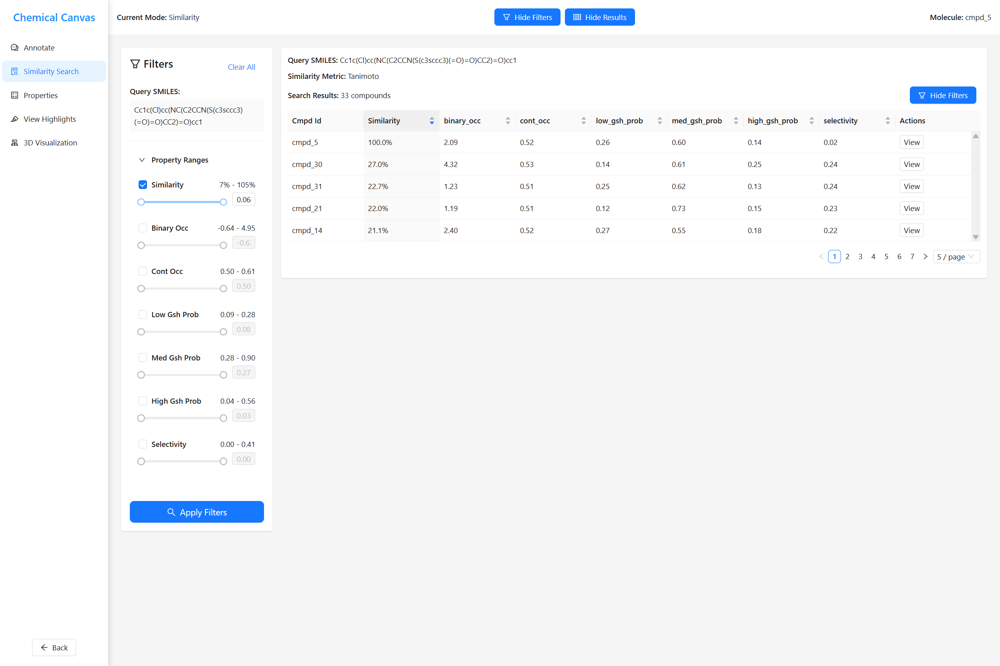
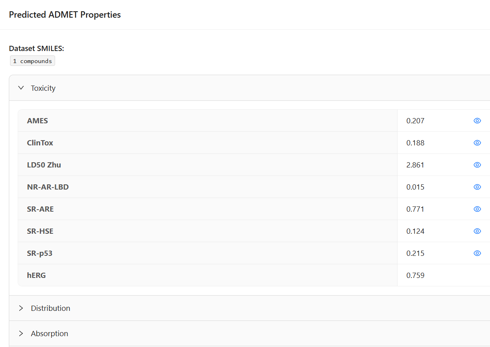
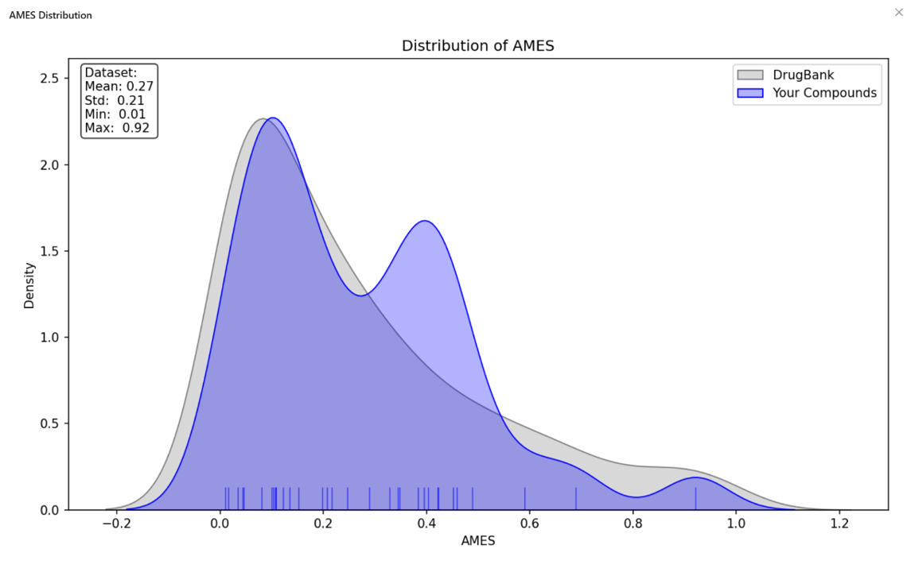
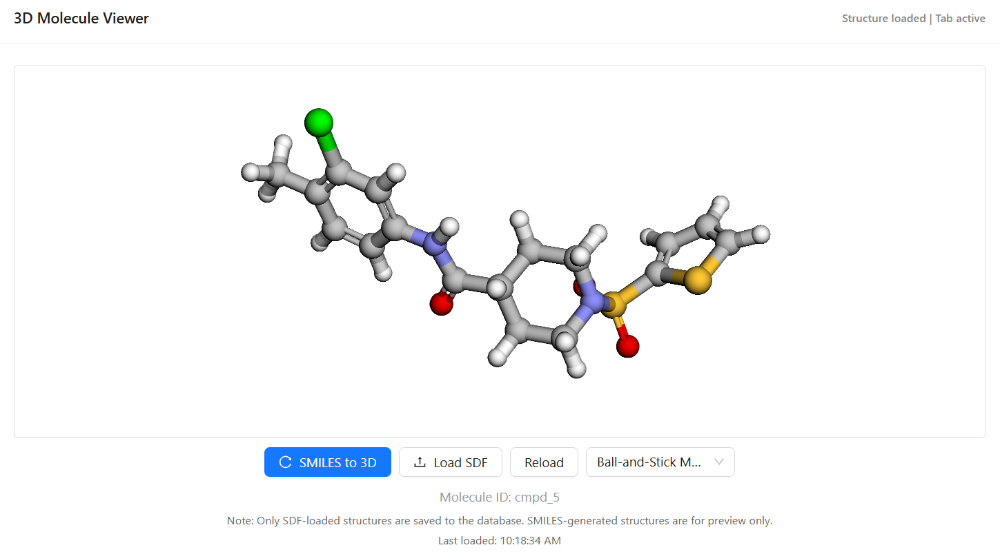

# 🧪 **Super-Glue: User Guide**

Welcome to **Super-Glue** — a web-based platform for molecular visualization, annotation, and similarity analysis. This guide will walk you through each step, from uploading a dataset to annotating molecules and running searches.

## 📁 **Table of Contents**

1. [Getting Started](#-getting-started)
2. [Homepage](#-homepage)
    - [Upload Dataset](#-upload-dataset)
    - [Select Recent Dataset](#-select-recent-dataset)
3. [Summary Page](#-summary-page)
    - [Compound Table](#-compound-table)
    - [My Structures](#️-my-structures)
4. [Annotation Page](#️-annotation-page)
    - [Highlights and Text Annotations](#-highlights-and--text-annotations)
    - [Substructure Matching](#-substructure-matching)
    - [Similarity Search](#-similarity-search)
    - [ADMET Property Calculation](#-admet-property-calculation)
    - [3D Visualization](#-3d-visualization)
    - [Export *(Planned)*](#-export-planned)
5. [Troubleshooting](#️-troubleshooting)
6. [Feedback and Support](#-feedback-and-support)

---

## 🚀 **Getting Started**

To use Super-Glue, you only need a modern web browser (Chrome, Edge, Firefox) and a CSV file containing molecular data.  

⚙️ To install and run Super-Glue locally, see the [Installation Guide in README.md](../README.md#installation).

---

## 🏠 **Homepage**

The Homepage is your starting point. Here, you can log in, upload a dataset or select a recent one.

### 🔐 Login (Required)

To access the platform, users must log in first. (This feature is a placeholder for future multi-user collaboration.)

- Click **Login** in the top-left corner
- If you're new, click **New User**
- Enter any example email (e.g. <email@example.com>)
- Set a password
- Click **Register** to create your account
- Go back to the login page to log in
- To log out, click the user icon in the top-left corner and select **Logout**

> 💡 Login is now required to use Super-Glue. This will enable future support for saved workspaces and team collaboration.

### 📤 Upload Dataset

After logging in, you can:

- Click **Upload CSV** to select a CSV file from your computer.
- Your CSV file should include at least:  
  - A `cmpd_id` column (Compound ID)
  - A `SMILES` column (Simplified Molecular Input Line Entry System)
  - Optional: Any number of property columns (e.g., activity, solubility)
- Upload a file to go to the **Summary Page**.

### 📁 Select Recent Dataset

- If you have previously uploaded datasets, you can select it from the **Recent Files** list.
- Click on a recent file to go directly to the **Summary Page**.

---

## 🧾 **Summary Page**

The Summary Page provides an overview of your dataset and lets you select compounds to explore.

### 🧪 Compound Table

- Here you'll see a preview of your dataset:
  - A list of all compounds and their SMILES.
  - Click any compound to go to the **Annotation Page**.

### 🖍️ My Structures

- You can now click **My Structures** in the top-left corner to:
  - View a table of **all** your saved highlights and annotations across the dataset
  - Quickly navigate back to compounds you've worked on
  - Resume or review annotations without searching manually

> 💡 This is helpful for tracking progress or finding interesting substructures you've marked earlier.

---

## ✏️ **Annotation Page**

The Annotation Page is where most of your work happens. Here, you can visualize, annotate, and analyze individual compounds. You can select tools from the left sidebar to perform various tasks.

### 📊 Property Table

- Displays the properties from your dataset for the selected compound.

### 🟡 Highlights and 💬 Text Annotations

- Select atoms or substructures to visually mark them of interest in the compound.
- Add comments to highlighted regions to describe reactions, hypotheses, or notes.
- View all highlights and annotations for the selected compound.
- Step-by-step guide:
  1. Click on **Annotate** on the left sidebar.
  2. Use the Ketcher **select tool** to select atoms or substructures.
  3. Click **Capture** to capture the selection.
  4. Optional: Add a comment in the text box to describe the highlight.
  5. Click **Save Annotation** to save your highlight. *Note: Please do not use the Ketcher highlight function to highlight because it will not save the highlight.*
  6. View all saved highlights by clicking "**View Highlights**" on the left sidebar. *Note: For now this is a separate tab, but in the future they will be integrated into one for easier access.*
  7. All highlights associated with the compound will be displayed in a table. Select a highlight to view it on Ketcher. *Note: Text displayed in the table is the comment you added when saving the highlight. If you did not add a comment, it will display system-generated highlight_id with italic text.*

> ⚠️ Note: Currently, saved highlights and annotations cannot be edited or deleted. This feature is planned for a future update.

### 🧩 Substructure Matching

- Search for compounds that contain a specific substructure you highlighted.
- Step-by-step guide:
  1. From **View Highlights** tab mentioned above, select a highlight.
  2. Click on the **Substructure Matching** tool below on the right sidebar.
  3. Returns a list of compounds that contains the selected substructure.

### 🔎 Similarity Search

- Search for similar compounds using different similarity metrics (Tanimoto, Russel,Dice, Sokal, Kulczynski, McConnaughey, Cosine).
- Return a list of similar compounds based on the selected metric.
- Step-by-step guide:
  1. Click on the **Similarity Search** on the left sidebar.
  2. Choose a **similarity metric** from the dropdown menu.
  3. (Optional) Adjust the **threshold** for similarity *(Planned)*.
  4. Click **Search** to find similar compounds.
  5. View results in the table below.
  6. Click **View** to see the compound.
  7. Apply **filters** to narrow down results based on properties.

> ⚠️ Note: The threshold before the search is yet to be implemented, so it will return all similar compounds. The view button is also not yet implemented.

### 🧮 ADMET Property Calculation

- Super-Glue uses machine learning to predict key drug-like properties (e.g., permeability, toxicity) based on the molecule’s SMILES string.
- We use the **ADMET** package — which stands for **Absorption**, **Distribution**, **Metabolism**, **Excretion**, and **Toxicity**.
- Predicted properties are grouped into these five categories, plus several additional ones.

- Step-by-step guide:
  1. Select **Properties** from the left sidebar
  2. Click **Calculate Properties** to begin prediction
  3. A full-screen table will display the results, **grouped by category**
  4. Click the 👁 **Eye icon** next to any property to see its **distribution across your dataset and DrugBank**

> 💡 The predicted values and charts are stored automatically for future use.

### 🌐 3D Visualization

- Visualize molecular structures in an interactive 3D viewer
- Rotate, zoom, and explore molecular geometries directly in your browser
- View structures automatically generated from SMILES
- For more accurate geometries (e.g. conformers), upload a custom SDF file
- Use the model style dropdown to switch between visualization styles
- Step-by-step guide:
  1. Click on **3D Visualization** in the left sidebar.
  2. If no SDF is uploaded, click **SMILES to 3D** and it will generate a 3D structure from the SMILES.
  3. To upload a custom SDF, click **Load SDF** and select your file.
  4. The viewer will update to show the new structure.
  5. Select a model style from the dropdown menu

> 💡 If an SDF was previously uploaded for a compound, it will be automatically loaded when revisiting.

### 📥 Export *(Planned)*

- Export your annotated dataset in various formats (CSV, JSON, etc.) for further analysis or sharing.

---

## 🛠️ **Troubleshooting**

| Problem | Suggested Solution |
|--------|---------------------|
| **General Issues** | |
| Table content not showing or overflowing | Adjust your browser zoom or scroll horizontally. |
| Full-screen pages has no back button | Use the browser’s back button to return to the previous page. A future fix will add an in-app back button. |
| Long loading or slow interactions | Large datasets or ADMET calculations may take time. Wait or reduce dataset size. |
| **Login Issues** | |
| Captcha fails to load | This may happen if backend services are down. Make sure the backend is running. |
| Unexpected log out | This will happen if you try to refresh the page while logged in. |
| **Annotate / Highlight and Substructure Match** | |
| Highlights not saving | Ensure you're using the **Ketcher select tool**, then click **Capture Selection** before saving. Don’t use Ketcher’s built-in highlight tool — it doesn’t persist. |
| Highlights not showing on Ketcher when selected from table | If you only select one atom, the highlight will be saved but not rendered in Ketcher. Select at least one atome and one bond to see the highlight. Select at least two atoms and one bond to use the substructure matching tool. |
| Selected highlight remains active | When a highlight is selected, it stays rendered in Ketcher until you select another one, even if you switch tools. It does not affect other functions. If you want to clear it, use Ketcher's built-in highlight tool (select and right click) to remove it. |
| Cannot edit or delete highlights | Currently, highlights cannot be edited or deleted. This feature is planned for a future update. |
| Highlight showing different structure in Ketcher and error in substructure matching | This is likely because you viewed one of the similarity search results in Ketcher, which desynchronizes the backend. Go back to the Summary Page and reselect the compound to restore backend linkage. Avoid using other functions before doing this. |
| Substructure matching showing no results | Try a broader or valid highlight (must contain at least two atoms and a bond). Invalid selections won’t match correctly. |
| **Similarity Search** | |
| Similarity search throws an error | This may happen if you're using a dataset uploaded by another account. Go to the Homepage and re-upload the dataset under your current user to reset session state. |
| Blank filter modal before search | This function is not yet implemented. The filter modal will be available in a future update. |
| "View" button in similarity results causes desync (e.g., properties don’t match or substructure matching fails) | Clicking **View** loads the molecule into Ketcher, but doesn't sync the backend. Fix: Go to the Summary Page and reselect the compound to restore backend linkage. Avoid using other functions before doing this. |
| **ADMET Properties** | |
| ADMET distribution chart doesn’t show selected molecule | The red marker for the current molecule is missing. A future update will restore it for easier interpretation. |

## 📬 **Feedback and Support**

Thank you for using Super-Glue! This is a work in progress, and we welcome your feedback. If you encounter any issues or have suggestions, please reach out to us using GitHub Issues.
